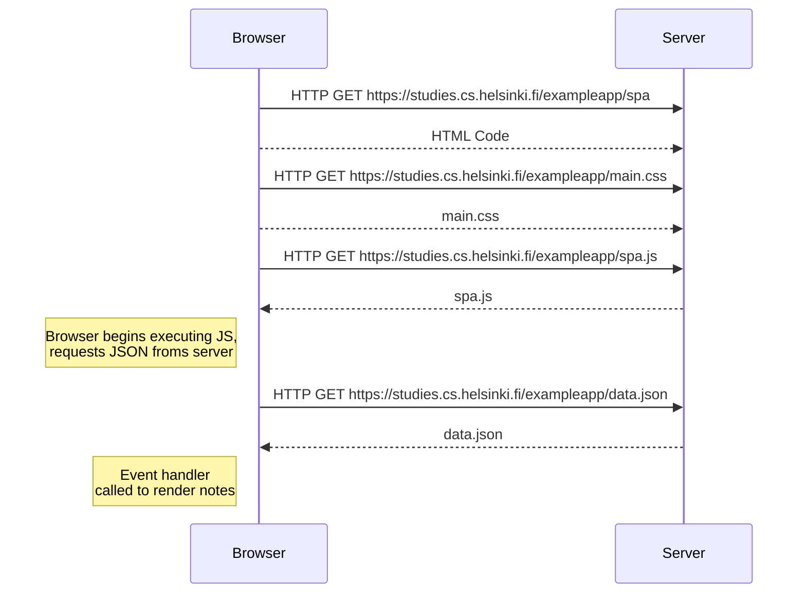

```mermaid
sequenceDiagram
participant Browser
participant Server
    Browser ->> Server: HTTP GET https://studies.cs.helsinki.fi/exampleapp/spa
    Browser -->> Server: HTML Code
    Browser ->> Server: HTTP GET https://studies.cs.helsinki.fi/exampleapp/main.css
    Browser -->> Server: main.css
    Browser ->> Server: HTTP GET https://studies.cs.helsinki.fi/exampleapp/spa.js
    Server -->> Browser: spa.js
    Note left of Browser: Browser begins executing JS,<br/>requests JSON froms server
    Browser ->> Server: HTTP GET https://studies.cs.helsinki.fi/exampleapp/data.json
    Server -->> Browser: data.json
    Note left of Browser: Event handler<br/>called to render notes
```