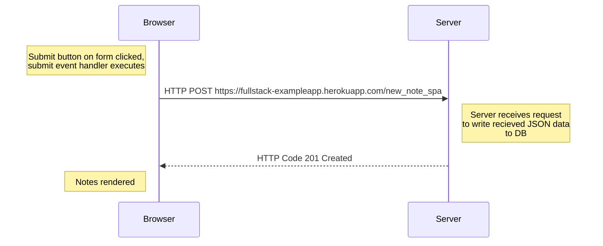

```mermaid
sequenceDiagram
participant Browser
participant Server

    Note left of Browser: Submit button on form clicked,<br/>submit event handler executes
    Browser ->> Server: HTTP POST https://fullstack-exampleapp.herokuapp.com/new_note_spa
    Note right of Server: Server receives request<br/>to write recieved JSON data<br/>to DB
    Server -->> Browser: HTTP Code 201 Created
    Note left of Browser: Notes rendered
```
